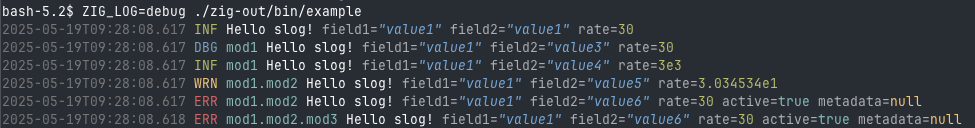

# Structured Logging for Zig

`slog` is a configurable, structured logging package for Zig with support for hierarchical loggers.


## Usage
Add `slog` to your `build.zig.zon`
```
zig fetch --save git+https://github.com/sam701/slog
```

Example code:
```zig
const std = @import("std");
const slog = @import("slog");

pub fn main() !void {
    var log = try slog.initRootLogger(std.heap.page_allocator, .{});
    defer log.deinit();

    var log2 = try log.initChildLogger("mod1");
    var log3 = try log2.initChildLogger("mod2");
    var log4 = try log3.initChildLogger("mod3");

    log.info("Hello slog!", .{ .field1 = "value1", .field2 = "value1", .rate = 30 });
    log2.trace("Hello slog!", .{ .field1 = "value1", .field2 = "value2", .rate = 30 });
    log2.debug("Hello slog!", .{ .field1 = "value1", .field2 = "value3", .rate = 30 });
    log2.info("Hello slog!", .{ .field1 = "value1", .field2 = "value4", .rate = 30e2 });
    log3.warn("Hello slog!", .{ .field1 = "value1", .field2 = "value5", .rate = 30.34534 });
    log3.err("Hello slog!", .{ .field1 = "value1", .field2 = "value6", .rate = 30, .active = true, .metadata = null });
    log4.err("Hello slog!", .{ .field1 = "value1", .field2 = "value6", .rate = 30, .active = true, .metadata = null });
}
```


## Environment Variables
* `ZIG_LOG` - configures log level, e.g. `info,mod1=debug,mod2.mod3=warn`.
* `ZIG_LOG_COLORS` - configures color scheme for text logger, e.g. `timestamp=31;1,logger=33`.

## Dependencies
* [zeit](https://github.com/rockorager/zeit?tab=readme-ov-file) - a great date and time library for Zig
